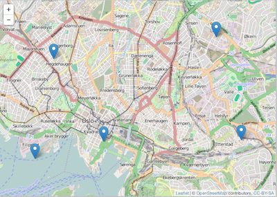
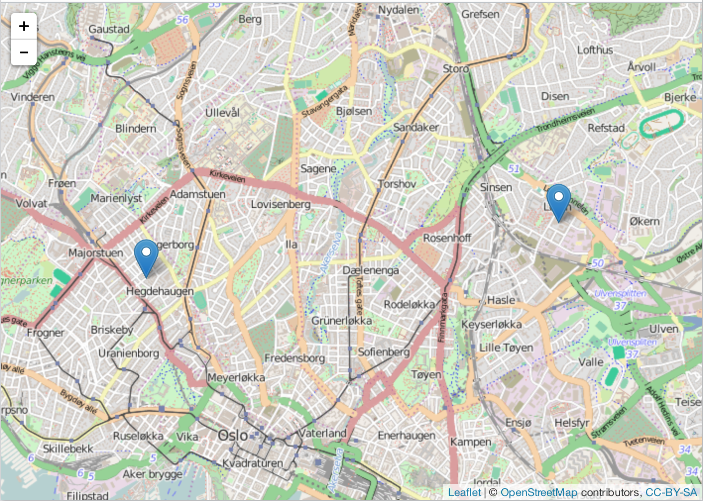

lawn
=======


[](https://cranchecks.info/pkgs/lawn)
[](https://travis-ci.org/ropensci/lawn)
[](https://ci.appveyor.com/project/sckott/lawn)
[](https://codecov.io/github/ropensci/lawn?branch=master)
[](https://github.com/metacran/cranlogs.app)
[](https://cran.r-project.org/package=lawn)

`lawn` is an R wrapper for the Javascript library [turf.js](http://turfjs.org/). In addition, we have a few functions to interface with the [geojson-random](https://github.com/mapbox/geojson-random) and [geojsonhint](https://www.npmjs.com/package/geojsonhint) Javascript libraries, for generating random GeoJSON objects and linting GeoJSON, respectively.

## Install

The latest release of `lawn` is available from CRAN.  To install:


```r
install.packages("lawn")
```

To install the development version:


```r
install.packages("devtools")
devtools::install_github("ropensci/lawn")
```


```r
library("lawn")
```

## count

Count number of points within polygons


```r
lawn_count(lawn_data$polygons_count, lawn_data$points_count, 'population')
#> <FeatureCollection>
#>   Bounding box: -112.1 46.6 -112.0 46.6
#>   No. features: 2
#>   No. points: 20
#>   Properties: 
#>     values count
#> 1 200, 600     2
#> 2              0
```

## average

Average value of a field for a set of points within a set of polygons


```r
lawn_average(polygons = lawn_data$polygons_average, points = lawn_data$points_average, 'population')
#> <FeatureCollection>
#>   Bounding box: 10.7 59.9 10.9 59.9
#>   No. features: 2
#>   No. points: 20
#>   Properties: 
#>          values average
#> 1 200, 600, 100     300
#> 2      200, 300     250
```

## distance

Define two points


```r
from <- '{
 "type": "Feature",
 "properties": {},
 "geometry": {
   "type": "Point",
   "coordinates": [-75.343, 39.984]
 }
}'
to <- '{
  "type": "Feature",
  "properties": {},
  "geometry": {
    "type": "Point",
    "coordinates": [-75.534, 39.123]
  }
}'
```

Calculate distance, default units is kilometers (`km`)


```r
lawn_distance(from, to)
#> [1] 97.15958
```

## random set of points


```r
lawn_random(n = 2)
#> <FeatureCollection>
#>   Bounding box: -31.3 3.2 155.0 67.6
#>   No. features: 2
#>   No. points: 4
#>   Properties: NULL
```


```r
lawn_random(n = 5)
#> <FeatureCollection>
#>   Bounding box: -50.6 -78.2 68.1 52.2
#>   No. features: 5
#>   No. points: 10
#>   Properties: NULL
```

## random features with geojson-random

Points


```r
gr_point(2)
#> <FeatureCollection>
#>   Bounding box: -89.0 -7.1 123.4 -0.7
#>   No. features: 2
#>   No. points: 4
#>   Properties: NULL
```

Positions


```r
gr_position()
#> [1]  -7.546582 -66.863360
```

Polygons


```r
gr_polygon(n = 1, vertices = 5, max_radial_length = 5)
#> <FeatureCollection>
#>   Bounding box: 76.8 -88.4 80.6 -83.6
#>   No. features: 1
#>   No. points: 12
#>   Properties: NULL
```

## sample from a FeatureCollection


```r
dat <- lawn_data$points_average
lawn_sample(dat, 1)
#> <FeatureCollection>
#>   Bounding box: 10.7 59.9 10.7 59.9
#>   No. features: 1
#>   No. points: 2
#>   Properties: 
#>   population
#> 1        100
```


```r
lawn_sample(dat, 2)
#> <FeatureCollection>
#>   Bounding box: 10.8 59.9 10.8 59.9
#>   No. features: 2
#>   No. points: 4
#>   Properties: 
#>   population
#> 1        200
#> 2        300
```


```r
lawn_sample(dat, 3)
#> <FeatureCollection>
#>   Bounding box: 10.7 59.9 10.8 59.9
#>   No. features: 3
#>   No. points: 6
#>   Properties: 
#>   population
#> 1        600
#> 2        200
#> 3        100
```

## extent


```r
lawn_extent(lawn_data$points_average)
#> [1] 10.71579 59.90478 10.80643 59.93162
```

## within


```r
lawn_within(lawn_data$points_within, lawn_data$polygons_within)
#> <FeatureCollection>
#>   Bounding box: -46.6 -23.6 -46.6 -23.6
#>   No. features: 2
#>   No. points: 4
#>   Properties: NULL
```

## buffer


```r
dat <- '{
 "type": "Feature",
 "properties": {},
 "geometry": {
     "type": "Polygon",
     "coordinates": [[
       [-112.072391,46.586591],
       [-112.072391,46.61761],
       [-112.028102,46.61761],
       [-112.028102,46.586591],
       [-112.072391,46.586591]
     ]]
   }
}'
lawn_buffer(dat, 1, "miles")
#> <Feature>
#>   Type: Polygon
#>   Bounding box: -112.1 46.6 -112.0 46.6
#>   No. points: 74
#>   Properties: NULL
```

## view

`lawn` includes a tiny helper function for visualizing geojson.


```r
view(lawn_data$points_average)
```



Or during process of manipulating geojson, view at mostly any time.

Here, we sample at random two points from the same dataset just viewed.


```r
lawn_sample(lawn_data$points_average, 2) %>% view()
```



## Contributors

* [Scott Chamberlain](https://github.com/sckott)
* [Jeff Hollister](https://github.com/jhollist)
* [Thanh Lê](https://github.com/thanhleviet)

## Meta

* Please [report any issues or bugs](https://github.com/ropensci/lawn/issues).
* License: MIT
* Get citation information for `lawn` in R doing `citation(package = 'lawn')`
* Please note that this project is released with a [Contributor Code of Conduct](CODE_OF_CONDUCT.md). By participating in this project you agree to abide by its terms.

## Additional disclaimer
Portions of this code have been contributed by Jeff Hollister, US EPA.  As such, that code is subjec to the following disclaimer: <https://www.epa.gov/home/github-contribution-disclaimer>

[](http://ropensci.org)
