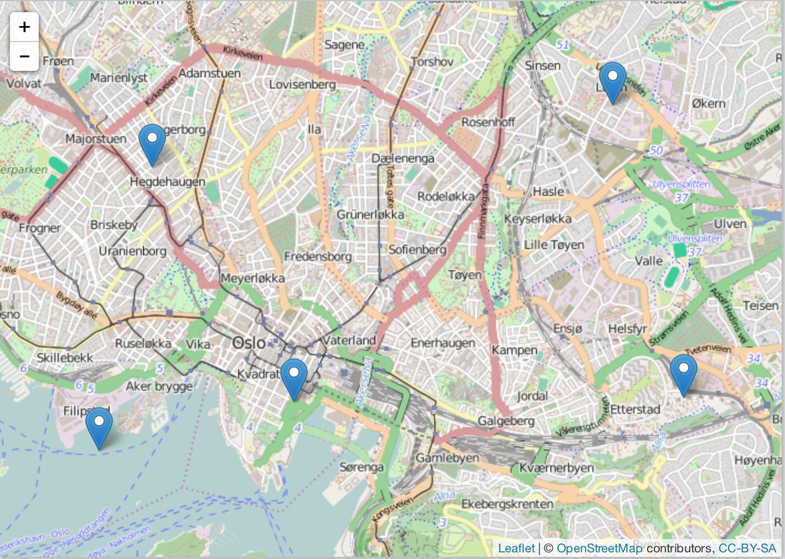
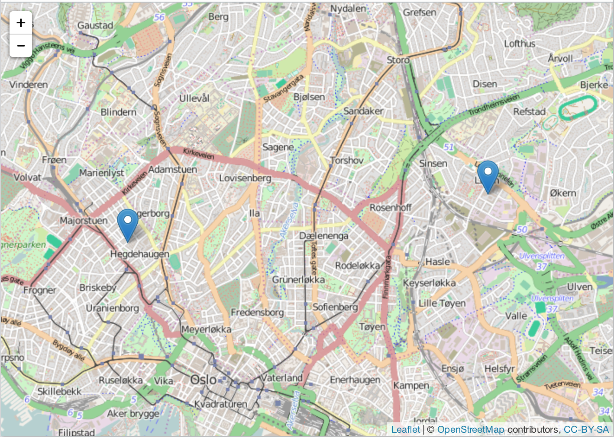

```{r echo=FALSE}
library("knitr")
hook_output <- knitr::knit_hooks$get("output")
knitr::knit_hooks$set(output = function(x, options) {
   lines <- options$output.lines
   if (is.null(lines)) {
     return(hook_output(x, options))  # pass to default hook
   }
   x <- unlist(strsplit(x, "\n"))
   more <- "..."
   if (length(lines)==1) {        # first n lines
     if (length(x) > lines) {
       # truncate the output, but add ....
       x <- c(head(x, lines), more)
     }
   } else {
     x <- c(if (abs(lines[1])>1) more else NULL,
            x[lines],
            if (length(x)>lines[abs(length(lines))]) more else NULL
           )
   }
   # paste these lines together
   x <- paste(c(x, ""), collapse = "\n")
   hook_output(x, options)
 })

knitr::opts_chunk$set(
  comment = "#>",
  collapse = TRUE,
  warning = FALSE,
  message = FALSE
)
```

`lawn` is an R wrapper for the Javascript library [turf.js](http://turfjs.org/) for advanced geospatial analysis. In addition, we have a few functions to interface with the [geojson-random](https://github.com/mapbox/geojson-random) Javascript library.

`lawn` includes traditional spatial operations, helper functions for creating GeoJSON data, and data classification and statistics tools.

There is an additional helper function (see `view()`) in this package to help visualize data with interactive maps via the `leaflet` package ([https://github.com/rstudio/leaflet](https://github.com/rstudio/leaflet)). Note that `leaflet` is not required to install `lawn` - it's in Suggests, not Imports or Depends.

## Install

If installing `leaflet`

```{r eval=FALSE}
devtools::install_github("rstudio/leaflet")
```

Stable `lawn` version from CRAN

```{r eval=FALSE}
install.packages("lawn")
```

Or, the development version from Github

```{r eval=FALSE}
devtools::install_github("ropensci/lawn")
```

```{r}
library("lawn")
```

## Make some geojson data

Point

```{r}
lawn_point(c(-74.5, 40))
```

Polygon

```{r}
rings <- list(list(
  c(-2.275543, 53.464547),
  c(-2.275543, 53.489271),
  c(-2.215118, 53.489271),
  c(-2.215118, 53.464547),
  c(-2.275543, 53.464547)
))
lawn_polygon(rings)
```

## count

Count number of points within polygons

```{r}
lawn_count(polygons = lawn_data$polygons_count, points = lawn_data$points_count, "population")
```

## average

Average value of a field for a set of points within a set of polygons

```{r}
lawn_average(polygons = lawn_data$polygons_average,
             points = lawn_data$points_average, 
             in_field = 'population')
```

## distance

Define two points

```{r}
from <- '{
 "type": "Feature",
 "properties": {},
 "geometry": {
   "type": "Point",
   "coordinates": [-75.343, 39.984]
 }
}'
to <- '{
  "type": "Feature",
  "properties": {},
  "geometry": {
    "type": "Point",
    "coordinates": [-75.534, 39.123]
  }
}'
```

Calculate distance, default units is kilometers (default output: `km`)

```{r}
lawn_distance(from, to)
```

## random set of points

```{r}
lawn_random(n = 2)
```

```{r}
lawn_random(n = 5)
```

## random features with geojson-random

Positions

```{r}
gr_position()
```

Points

```{r}
gr_point(2)
```

Polygons

```{r}
gr_polygon(n = 1, vertices = 5, max_radial_length = 5)
```

## sample from a FeatureCollection

```{r}
dat <- lawn_data$points_average
lawn_sample(dat, 1)
```

```{r}
lawn_sample(dat, 2)
```

```{r}
lawn_sample(dat, 3)
```

## extent

```{r}
lawn_extent(lawn_data$points_average)
```

## within

```{r}
lawn_within(lawn_data$points_within, lawn_data$polygons_within)
```

## buffer

```{r}
dat <- '{
 "type": "Feature",
 "properties": {},
 "geometry": {
     "type": "Polygon",
     "coordinates": [[
       [-112.072391,46.586591],
       [-112.072391,46.61761],
       [-112.028102,46.61761],
       [-112.028102,46.586591],
       [-112.072391,46.586591]
     ]]
   }
}'
lawn_buffer(dat, 1, "miles")
```

## lint input geojson

For most functions, you can lint your input geojson data to make sure it is proper geojson. We use
the javascript library geojsonhint. See the `lint` parameter where available.

Good GeoJSON

```{r}
dat <- '{
  "type": "FeatureCollection",
  "features": [
    {
      "type": "Feature",
      "properties": {
        "population": 200
      },
      "geometry": {
        "type": "Point",
        "coordinates": [10.724029, 59.926807]
      }
    },
      {
      "type": "Feature",
      "properties": {
        "population": 600
      },
      "geometry": {
        "type": "Point",
        "coordinates": [10.715789, 59.904778]
      }
    }
  ]
}'
lawn_extent(dat)
```

Bad GeoJSON

```{r eval=FALSE}
dat <- '{
  "type": "FeatureCollection",
  "features": [
    {
      "type": "Feature",
      "properties": {
        "population": 200
      },
      "geometry": {
        "type": "Point"
      }
    },
      {
      "type": "Feature",
      "properties": {
        "population": 600
      },
      "geometry": {
        "type": "Point",
        "coordinates": [10.715789, 59.904778]
      }
    }
  ]
}'
lawn_extent(dat, lint = TRUE)

#> Error: Line 1 - "coordinates" member required
```

## view

`lawn` includes a tiny helper function for visualizing geojson.

```{r eval=FALSE}
view(lawn_data$points_average)
```



Here, we sample at random two points from the same dataset just viewed.

```{r eval=FALSE}
lawn_sample(lawn_data$points_average, 2) %>% view()
```


